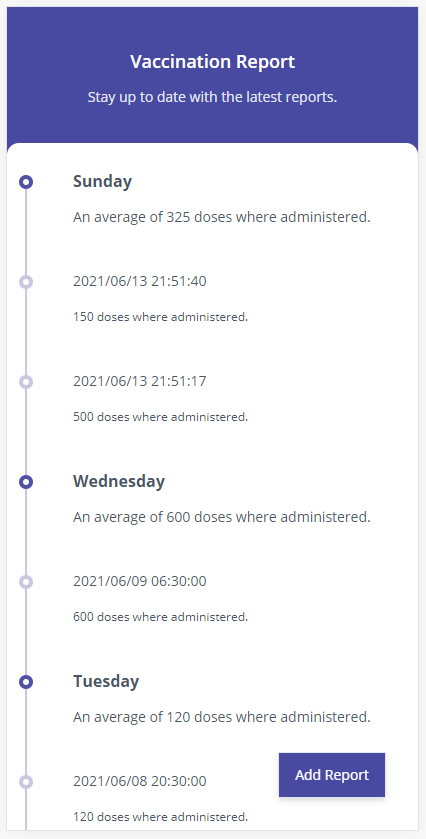
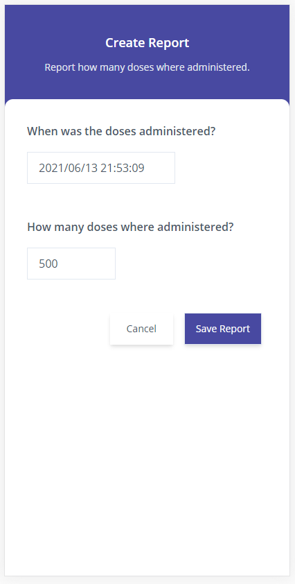

# Vaccination Tracker

This is an example application that lets users track the number of doses of vaccine administered.

<div style="display: flex; justify-content: center">





</div>

## Quick Start

Install the dependencies

```sh
yarn
```

Run the application

```sh
yarn dev
```

Then visit http://localhost:3000/ to see it in action.

## The application

The application in this repository consists of two parts, the backend, and the frontend. They are located in `src/server` and `src/app` respectively.

The backend uses Koa, a framework made by the team behind Express. It renders and serves the app as well as provide an API for data access.

The frontend is a React app built using Webpack.

### Styling

Make your application shine with [Tailwind CSS](https://tailwindcss.com/), a utility-first CSS framework for
rapidly building custom designs.

Tailwind works great with a component-based approach such as React and makes it easy for people of different levels of CSS knowledge to create beautiful pages.

```ts
export default function CorgiCard({ image, text }: CorgiCardProps): ReactElement {
  return (
    <div className="bg-white border-gray-400 mb-8 mx-4 p-4">
      

      <div className="w-48">
        <p className="break-normal px-4 text-sm text-center text-gray-700">
          { text }
        </p>
      </div>
    </div>
  );
}
```

Tailwind CSS is built using PostCSS and that's set up to use within the project. Tailwind can be customized using the configuration file `src/app/tailwind.js`.

You might have noticed that the CSS bundle is gigantic. This is because TailwindCSS generates a ton of different classes you can use. In production, PurgeCSS is scanning your components and removes unused styles. For this to work correctly, don't use string concatenation to build your class names. [Learn more.](https://tailwindcss.com/docs/controlling-file-size/)

## Testing

The entire application is tested using Jest and you can use either `yarn test` or `yarn test:watch` to run them. For the API endpoints, supertest is used to do integration tests. An example of this can be found in `src/server/api/corgi.spec.ts`.

For the React part, [Testing Library](https://testing-library.com/docs/react-testing-library/example-intro) is the way to go. It can be used to render components and make assertions against them.

```ts
it('Shows a picture of a Corgi', () => {
  render(<CorgiCard image='corgi.png' text='Describing text.' />);

  const image = screen.getByRole('img');

  expect(image).toHaveAttribute('alt', 'Describing text.');
  expect(image).toHaveAttribute('src', '/images/corgi.png');
});
```

## Linting

You can make sure you and your team keep the code style consistent by running `yarn lint`. This is powered by ESLint and rules can be added or removed in `.eslintrc.js`.

## Deploy

The whole application can be built with the command

```sh
yarn build
```

Once it has been built, you can start it with

```sh
yarn start
```

The server will listen to port 3000 by default and it can be overridden by setting the environment variable `PORT`.
